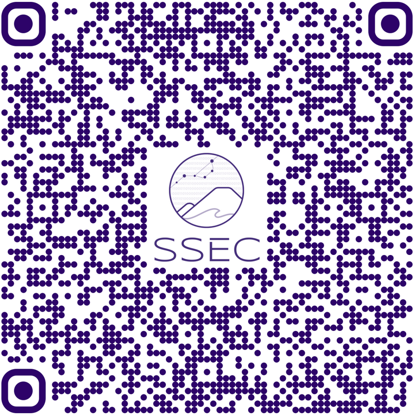

# Session 6: Synthesis & Next Steps

```{include} ../timers/timer-5-minutes.md

```

```{admonition} Instructions
:class: attention

- Facilitators work to highlight emerging themes from voting patterns:
    - Note unexpected interdisciplinary connections.
    - Common research challenges across fields.
    - Identify most promising use cases.
    - Share how these ideas could be developed further.
- Please take this time to fill out the following brief survey to tell us a little about your experience in this workshop and any future interests:

    - 
```
