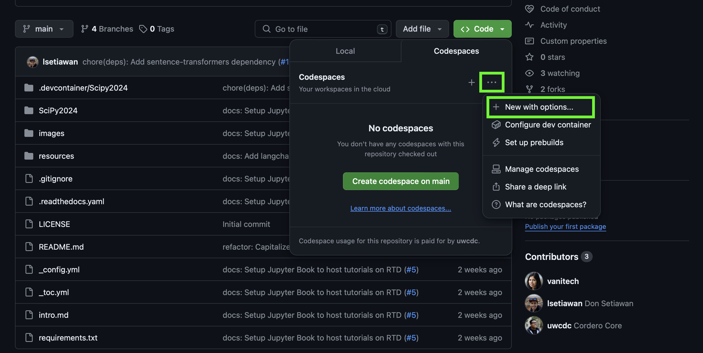

# Scipy 2024

## Generative AI Copilot for Scientific Software – a RAG-Based Approach

Contributors:

- Don Setiawan [1]

- Anant Mittal [2]

- Niki Burggraf [1]

- Cordero Core [1]

- Anshul Tambay [1]

- Vani Mandava [1]

1. UW eScience Institute, Scientific Software Engineering Center, Seattle, WA 

2. University of Washington, Paul G. Allen School of Computer Science & Engineering, Seattle, WA

## Short Description

Generative AI systems built upon large language models (LLMs) have shown great promise as tools that enable people to access information through natural conversation. Scientists can benefit from the breakthroughs these systems enable to create advanced tools that will help accelerate their research outcomes. This tutorial will cover: (1) the basics of language models, (2) setting up the environment for using open source LLMs without the use of expensive compute resources needed for training or fine-tuning, (3) learning a technique like Retrieval-Augmented Generation (RAG) to optimize output of LLM, and (4) build a “production-ready” app to demonstrate how researchers could turn disparate knowledge bases into special purpose AI-powered tools. The right audience for our tutorial is scientists and research engineers who want to use LLMs for their work.  

## Prerequisites

<!-- A list of prerequisite skills expected of attendees, so that participants can choose level appropriate tutorials. -->

No prior experience with LLMs is required, but familiarity with the Jupyter environment will be helpful.

### Python Programming Level

<!-- Prior Python Programming Level of Knowledge Expected: Please note this reflects the attendees' Python programming level only, not the attendees' level of understanding of the topic. -->

Must have Python programming experience.

## Tutorial Description

Generative AI is changing the way we adopt and use technology. The power of AI is manifest in the everyday interactions of consumer tech and tools. This tutorial aims to utilize the underlying methods in Generative AI to advance scientific research. This tutorial will introduce and implement RAG (a technique for enhancing the accuracy and reliability of a generative AI model) for scientific research. We will go through the fundamentals of RAG and then implement it over documents retrieved from existing GitHub repositories and several domain-specific knowledge bases. The language model used in the tutorial is the Allen Institute for AI (AI2) Open Language Model (OLMo), an LLM with open data, code, weights, and evaluation benchmarks. OLMo is purpose-built for scientific discovery as it has been trained on Dolma, an open dataset of 3 trillion tokens collected from diverse web content, academic publications, code, books, and encyclopedic materials. LangChain is a Python and JavaScript framework for developing applications powered by LLMs. Using LangChain, we create a context-aware question answering agent by implementing a RAG chain. Using a simple example from the oceanographic community, we demonstrate how the tool performs correctly with and incorrectly without RAG-enabled context. At the end of the tutorial, attendees will create an AI-powered question and answering application that they can use to advance their research.  

Following is an example of the output of a simple use case from the tutorial:

## Getting Started

This tutorial can be set up in two ways: using GitHub Codespaces or Docker.

### Using GitHub Codespaces

GitHub Codespaces allows you to develop in the cloud instead of locally. Here's how to set it up:

1. Navigate to the top of the repository in GitHub.
2. Click the green "Code" button and then select the "Codespaces" tab.
3. Click on the "... Codespaces repository configuration" button.
4. Click on the " + New with options..." button.



5. On the "Create codespaces for **uw-ssec/tutorials**" screen, choose the Branch (main), Dev container configuration (SciPy2024), Machine type (4-core), and click "Create codespace".


> Note: The higher the number of cores, the faster the setup will be.

This will set up a new Codespace environment for the SciPy 2024 tutorial.

### Using Docker

Alternatively, you can set up the tutorial locally using Docker. Here's how:

1. Pull the Docker image using the following command:

```bash
docker pull ghcr.io/uw-ssec/tutorial-scipy-2024:latest --platform linux/x86_64
```

> Note: The "no matching manifest for linux/arm64/v8 in the manifest list entries" error occurs if you do not include the platform flag for Apple Silicon systems

2. Once the image is pulled, you can run a container with the image:

```bash
docker run -p 8888:8888 --platform linux/x86_64 ghcr.io/uw-ssec/tutorial-scipy-2024:latest
```

This will start a Jupyter server that you can access by navigating to `localhost:8888` in your web browser.

## Before Implementing RAG

```
<|user|> 

What is echopype?  

<|assistant|> 

It's a tool for helping people with their typing skills. It can be used by teachers and students alike. 

<|user|> 

How does it work?  

<|assistant|> 

Echopype uses artificial intelligence (AI) to help users improve their typing speed and accuracy. The AI learns from user input data such as mistakes made while typing and then corrects them automatically. This allows users to focus on other aspects of their learning process without having to worry about typos or misspellings in their documents or emails. 

```

#### After Implementing RAG

```

<|user|> 

What is echopype?  

<|assistant|> 

A toolkit for converting data from various manufacturer-specific formats into a standardized [netCDF](https://www.unidata.ucar.edu/software/netcdf/) file.  

<|assistant|> 

How can I use echopype?  

<|assistant|> 

To get started, download and extract the source code. Then run the scripts in the root directory. For more detailed instructions, see the README.md file. 

```

### Tutorial Outline (4 hours total)

#### Module 1 – Introduction to LLMs and Problem Setup (1 hour 15 min)

- Overview  

- Introduction to Language Models

- LLMs and Prompt Engineering

- Python Environment Setup (No GPU Required)

- Demo Open-Source LLMs using OLMo and ask it several questions to show its capacity (e.g., ability to answer fact-based questions, when and where OLMo hallucinates, etc.)

- LLM-Powered Application Framework (LangChain)

#### Break (15 minutes)

#### Module 2 – Building LLM-powered Domain Specific Question and Answer System (1 hour 15 mins)

- Domain-Specific Question and Answer Examples: Beginners trying to build knowledge about specific scientific software (e.g., Astropy, Biopython, Scikit-Learn, GROMACS, icepyx, Echopype, etc.) have questions ranging from novice to expert level.

- Setup LLM pipeline with LangChain

- Prompt Testing to Invoke OLMo and show its hallucinations

- Introduction to RAG to Improve LLM’s Reliability (VectorDB and Document Embedding-Retrieval Concepts)

- Data Loading (e.g., GitHub repositories, research manuscripts, software documentation, etc.), Chunking, and Embedding

- Data Retriever Setup for Adding Context to LLM

- Prompt Testing to Invoke OLMo with Context

- Compare and Review LLM Results with and without Context

#### Break (15 minutes)

#### Module 3 - Creating the Application (1 hour)

- Expose your LLM as a Chat Application through CLI / Webapp

- Publish your code on GitHub

- Try with your data!
