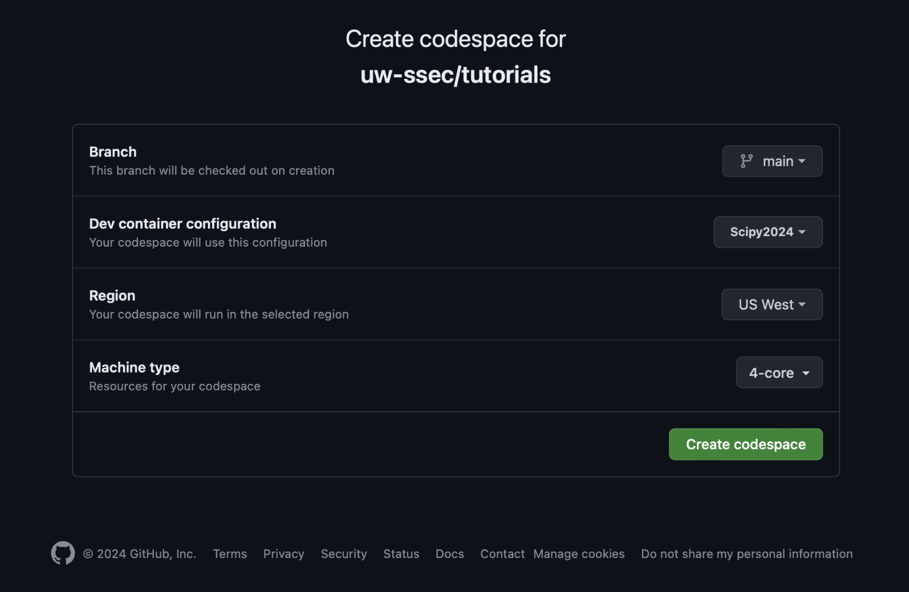

# Python Environment Setup

This tutorial can be set up in three ways: using GitHub Codespaces, Docker containers, or Conda environment.

## Using GitHub Codespaces

GitHub Codespaces allows you to develop in the cloud instead of locally. Here's how to set it up:

1. Navigate to the top of the repository in GitHub.
2. Click the green "Code" button and then select the "Codespaces" tab.
3. Click on the "... Codespaces repository configuration" button.
4. Click on the " + New with options..." button.

    

5. On the "Create codespaces for **uw-ssec/tutorials**" screen, choose the Branch (main), Dev container configuration (SciPy2024), Machine type (4-core), and click "Create codespace".

    

    > Note: The higher the number of cores, the faster the setup will be.

    This will set up a new Codespace environment for the SciPy 2024 tutorial.

## Using Docker

Alternatively, you can set up the tutorial locally using Docker. Here's how:

1. Pull the Docker image using the following command:

    ```bash
    docker pull ghcr.io/uw-ssec/tutorial-scipy-2024:latest --platform linux/x86_64
    ```

    > Note: The "no matching manifest for linux/arm64/v8 in the manifest list entries" error occurs if you do not include the platform flag for Apple Silicon systems

2. Once the image is pulled, you can run a container with the image:

    ```bash
    docker run -p 8888:8888 --platform linux/x86_64 -it ghcr.io/uw-ssec/tutorial-scipy-2024:latest bash
    ```

    This command will open an interactive container with a bash shell.

3. Clone the tutorial into the container:

    ```bash
    git clone https://github.com/uw-ssec/tutorials.git
    ```

    > Note: If you exit the container, run `docker ps -l` for the Container ID and `docker start -i <container_id>` to pick up where you left off.

    Now, you can navigate to the tutorial directory and start the tutorial.

> Note: If you would like to share your work with the rest of your team or have a reminder of the work you do in this tutorial, you can write your container to a new docker image. You can do that by running `docker commit <container_id> <new_image_name>` in your terminal.

## Using a Conda Environment

Finally, you can set up the tutorial locally using a Conda environment. Here's how:

1. Download the environment file:

    ```bash
    wget https://raw.githubusercontent.com/uw-ssec/docker-images/main/tutorial-scipy-2024/environment.yml
    ```

2. Create the Conda environment:

    ```bash
    conda env create -f environment.yml
    ```

3. Activate the Conda environment:

    ```bash
    conda activate scipy-2024
    ```

4. Clone the tutorial repository:

    ```bash
    git clone https://github.com/uw-ssec/tutorials.git
    ```

5. Navigate to the tutorial directory:

    ```bash
    cd tutorials/SciPy2024
    ```
